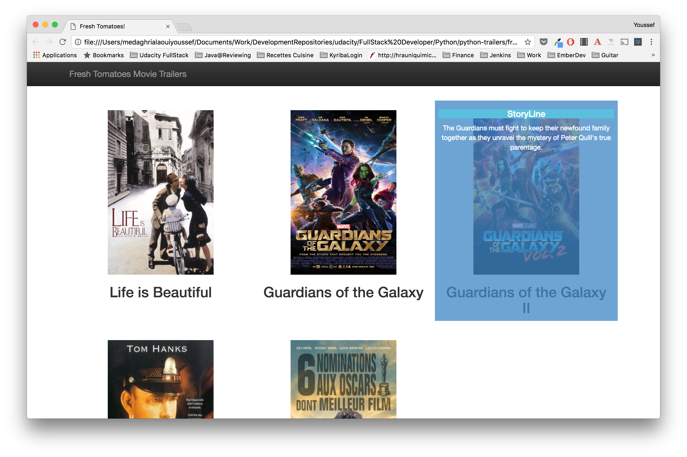

# ud036_StarterCode
Source code for a Movie Trailer website.

## Project Description
This project is a python project using server-side code to store a list of some of my favorite movies, including box art imagery and a movie trailer URL. The project is written in python and uses very basic bootstrap features.

# Basic Setup
1. Open the file _entertainment_center.py in a python IDE (for instance idle on macos installed by default
2. Execute the file (F5 on idle)
3. Tadaaaaa

## Questions

Having a problem getting something to work or want to know more ? Ping me on Twitter [@ymedaghri](https://twitter.com/ymedaghri) or file a [GitHub Issue](https://github.com/ymedaghri/python-trailers/issues/new).
 

